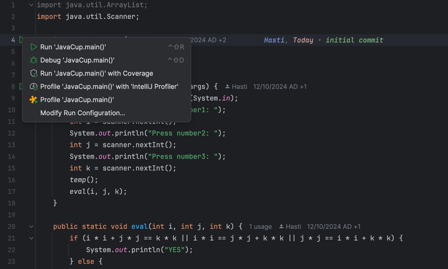

# [Kanban](https://github.com/users/HastiKarimi/projects/2/views/1)

# بخش اول 
برای اجرای کد با استفاده از
YourKit
ابتدا در کلاس شامل
main 
کلیک راست می‌کنیم و گزینه اجرا با استفاده از 
YourKit
را انتخاب می‌کنیم.

بعد از اجرای کد مشاهده می‌کنیم که خطای 
Java heap space 
می‌خوریم. 

پس از اصلاح ابعاد آرایه، به سراغ گزارش ساخته شده در برنامه 
YourKit 
می‌رویم. در این گزارش مشاهده می‌کنیم که تابع 
temp 
زمان اجرای زیادی می‌گیرد.

حال برای بهینه کردن این کد، به جای  
ArrayList 
از آرایه استفاده می‌کنیم. با این کار می‌توانیم هم میزان 
heap 
استفاده شده توسط برنامه را کاهش دهیم و هم چون دیگر از 
add 
استفاده نمی‌کنیم و این تابع زمان می‌گیرد، زمان اجرای برنامه هم به طور قابل توجهی کاهش پیدا می‌کند.

همچنین تابع 
temp 
بعد از بهبود به شکل زیر در می‌آید:

# بخش دوم 

در این بخش ابتدا کد زیر را می‌زنیم که قرار است بزرگترین عدد مربع کامل کوچک‌تر از 
MAX_INT
را پیدا کند. 

همانطور که مشاهده می‌کنید این کد به شکل بدی زده شده است، چون لازم نیست 
i 
تا خود 
MAX_INT
برود و کافی است تا رادیکال این مقدار را چک کند. در این حالت با استفاده از روش بالا در 
YourKit
برنامه را اجرا می‌کنیم و مشاهده می‌کنیم که تابع 
maxSquare 
زمان زیادی از اجرای برنامه را می‌گیرد.

حال نکته بالا را رعایت می‌کنیم و فقط تا رادیکال 
MAX_INT
چک می‌کنیم. با استفاده از این روش و اجرای دوباره کد توسط
YourKit
مشاهده می‌کنیم که زمان اجرای برنامه به شدت کاهش پیدا کرده است، در حدی که اصلا توابع 
main
و 
maxSquare 
را نمایش نمی‌دهد و کل اجرای برنامه در حدود 0 میلی‌ثانیه طول می‌کشد.

کد هم پس از اعمال این تغییر به شکل زیر در می‌آید:

